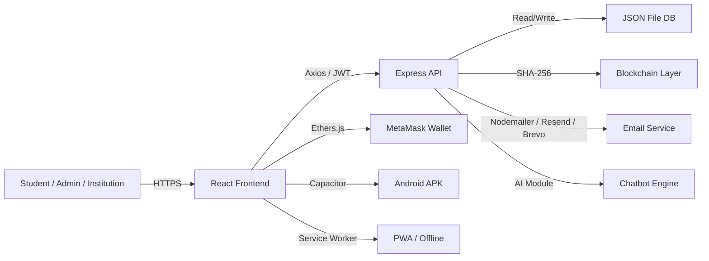

# 🎓 BlockEdu — Blockchain-Based Student Records Management System

<div align="center">


**A secure, decentralized, and feature-rich student records management system powered by blockchain technology. Available as a Web App, PWA, and Android APK.**

[Features](#-features) · [Architecture](#%EF%B8%8F-architecture) · [Tech Stack](#%EF%B8%8F-tech-stack) · [Quick Start](#-quick-start) · [Demo Credentials](#-demo-credentials) · [Mobile App](#-mobile-app) · [API Reference](#-api-reference) · [Security](#-security) · [Deployment](#-deployment)

</div>

---

## 🌐 Live Demo

| Platform | URL |
|----------|-----|
| **Web App** | [blockedu-tau.vercel.app](https://blockedu-tau.vercel.app) |
| **Backend API** | Hosted on [Render](https://render.com) |
| **Android APK** | Build locally (see [Mobile App](#-mobile-app)) |

---

## ✨ Features

### 🔐 Core Platform
| Feature | Description |
|---------|-------------|
| **Role-Based Access** | Separate portals for Students, Admins, and Institutions |
| **Blockchain Verification** | Tamper-proof record storage with SHA-256 hashing |
| **MetaMask Integration** | Web3 wallet-based authentication via Ethers.js |
| **JWT Authentication** | Secure token-based session management (24h expiry) |
| **OTP Email Verification** | Multi-provider email support (Gmail, Outlook, Resend, Brevo, Ethereal) |
| **Multilingual Support** | i18n with English, Hindi, and Telugu |
| **Session Timeout** | Auto-logout after inactivity with countdown warning modal |
| **PWA Support** | Installable as a Progressive Web App on any device |
| **Offline Data Bundle** | Download profile, results, attendance, & timetable for offline access |
| **JSON File Persistence** | Data survives server restarts via debounced file-based storage |

### 👨‍🎓 Student Portal
| Feature | Description |
|---------|-------------|
| **Dashboard** | Personalized stats — GPA, attendance, upcoming events |
| **Results** | Semester-wise grade view with blockchain verification & CGPA calculation |
| **Autonomous Results** | View uploaded autonomous exam result files |
| **Regulation Results** | View uploaded regulation result files |
| **Attendance** | Monthly tracker with circular **ProgressRing** visualizations |
| **Schedule** | Weekly timetable with day-wise class breakdown |
| **Assignments** | Track pending / submitted / graded assignments with submission |
| **Papers** | Academic paper library — browse, bookmark, rate (1–5 ★), download PDFs |
| **Certificates** | View earned certificates with blockchain hashes |
| **Fee Payments** | UPI-based payment with multiple fee types, **confetti** on success |
| **Notifications** | Real-time announcements with **swipe-to-dismiss** gestures |
| **ID Card** | Digital student identity card with **3D flip animation** and QR code |
| **Events** | Campus events calendar with registration |
| **Grievances** | Submit and track grievance tickets with admin responses |
| **AI Chatbot** | Intelligent study buddy — personalized to your results & attendance |
| **Analytics** | CGPA tracking, performance predictions, peer comparison, weak subject analysis |
| **Leaderboard** | Student rankings by CGPA & attendance — filterable by department |
| **Feedback** | Anonymous course & faculty feedback (1–5 ★ rating + comments) |
| **Settings** | Profile editing, Aadhaar/APAAR ID, password change, profile picture upload |

### 🛡️ Admin Panel
| Feature | Description |
|---------|-------------|
| **Student Records** | Full CRUD — register, edit, delete, bulk Excel upload |
| **Analytics Dashboard** | Real-time stats, department comparison, fee revenue, attendance distribution, performance tiers |
| **Results Management** | Publish / delete semester results per student with auto-notification |
| **Autonomous Results** | Upload & manage autonomous exam result files |
| **Regulation Results** | Upload & manage regulation result files |
| **Attendance System** | Mark daily attendance per subject/department, upload via Excel, view records with filters |
| **Certificate Generator** | 6+ template types — Bonafide, Character, Course, Internship, Degree, Merit — with blockchain hash & QR |
| **Workflow Manager** | Kanban-style task board with drag-and-drop, automation rules, predefined workflows (Admission, Fee Payment, Certificate Request) |
| **Grievance Manager** | View, respond to, and resolve student grievances with auto-notification |
| **Notification Publisher** | Create and broadcast announcements to all students |
| **User Management** | View all users, update roles, reset passwords, delete accounts |
| **System Logs** | Audit trail for password changes, user updates, account deletions |
| **Feedback Analytics** | View aggregated anonymous feedback per course/faculty |
| **Branch / Subject / Faculty** | CRUD management for branches (departments), subjects per branch, and faculty members |
| **Paper Management** | Upload PDFs with dedup check, Edit metadata, Bulk delete |
| **Institution Management** | Register, verify, update, and delete institutions |
| **Admin Stats** | Comprehensive system statistics — users, students, payments, blockchain transactions |

### 🏛️ Institution Portal
| Feature | Description |
|---------|-------------|
| **Dashboard** | Institution-level overview statistics |
| **Student Management** | Register and manage student records |
| **Settings** | Institution profile management |

### 🎨 UI / UX Polish
| Feature | Description |
|---------|-------------|
| **Dark / Light Theme** | Persistent toggle with smooth transitions |
| **Glassmorphism** | Frosted-glass card design with glow hover effects |
| **Skeleton Loaders** | Animated shimmer placeholders during data fetch |
| **Page Transitions** | Fade + slide animations between routes |
| **Button Ripple** | Material-style ripple on every button click |
| **Confetti Effect** | Celebratory burst on payment success & certificate download |
| **Progress Rings** | SVG circular progress for attendance percentages |
| **3D Flip Cards** | Interactive flip animation on student ID cards |
| **QR Code** | Auto-generated QR codes on ID cards for verification |
| **Notification Badges** | Pulsing red dots on sidebar for unread items |
| **Swipe Gestures** | Touch swipe-to-dismiss on notification cards |
| **Custom Scrollbar** | Thin, themed scrollbar matching the color scheme |
| **Mobile Bottom Nav** | Responsive tab bar for mobile screens (≤768px) |

### 📱 Mobile App
| Feature | Description |
|---------|-------------|
| **Android APK** | Native Android app via Capacitor |
| **Status Bar Support** | Proper spacing below phone status bar |
| **Mobile Sidebar** | Slide-in overlay with tap-outside-to-close |
| **Compact Top Bar** | Ultra-compact header optimized for mobile |
| **Responsive Layout** | Single-column cards, scrollable tables |
| **PWA Installable** | Install directly from browser — no APK needed |

---

## 🏗️ Architecture

### System Overview

```
┌──────────────────────────────────────────────────────────────────┐
│                         CLIENT LAYER                             │
│  ┌──────────┐  ┌──────────────┐  ┌────────────┐  ┌───────────┐  │
│  │ Web App  │  │  PWA (Offline │  │ Android APK│  │  MetaMask  │  │
│  │ (React)  │  │   Bundle)    │  │ (Capacitor)│  │  (Ethers)  │  │
│  └────┬─────┘  └──────┬───────┘  └─────┬──────┘  └─────┬─────┘  │
└───────┼───────────────┼────────────────┼──────────────┼─────────┘
        │               │                │              │
        └───────────────┼────────────────┘              │
                        ▼                               ▼
┌──────────────────────────────────────────────────────────────────┐
│                         API LAYER                                │
│                  Node.js + Express REST API                       │
│  ┌──────────┐ ┌──────────┐ ┌───────────┐ ┌──────────────────┐   │
│  │   Auth   │ │  Student │ │  Admin    │ │    Blockchain    │   │
│  │  Module  │ │  Routes  │ │  Routes   │ │    Routes        │   │
│  └──────────┘ └──────────┘ └───────────┘ └──────────────────┘   │
│  ┌──────────┐ ┌──────────┐ ┌───────────┐ ┌──────────────────┐   │
│  │  Email   │ │ AI Chat  │ │ Workflow  │ │ Rate Limiter +   │   │
│  │ Service  │ │  Bot     │ │  Engine   │ │ Helmet Security  │   │
│  └──────────┘ └──────────┘ └───────────┘ └──────────────────┘   │
└────────────────────────┬────────────────────────────────────────┘
                         │
                         ▼
┌──────────────────────────────────────────────────────────────────┐
│                       DATA LAYER                                 │
│  ┌─────────────────┐  ┌─────────────────┐  ┌─────────────────┐  │
│  │   JSON File DB  │  │    File Uploads  │  │  Blockchain     │  │
│  │  (data/db.json) │  │  (uploads/papers)│  │  (SHA-256 Hash) │  │
│  │  • Debounced    │  │  • PDF papers    │  │  • Tx records   │  │
│  │    auto-save    │  │  • Profile pics  │  │  • Verification │  │
│  │  • Graceful     │  │  • 20MB limit    │  │  • Smart        │  │
│  │    shutdown     │  │                  │  │    Contract     │  │
│  └─────────────────┘  └─────────────────┘  └─────────────────┘  │
└──────────────────────────────────────────────────────────────────┘
```

### Data Flow



### Authentication Flow

```
┌────────────┐     ┌────────────┐     ┌──────────────┐
│   Login    │────▶│  JWT Token │────▶│  Protected   │
│  Options   │     │  (24h TTL) │     │   Routes     │
├────────────┤     └────────────┘     └──────────────┘
│ Email+Pass │            │
│ MetaMask   │            ▼
│ OTP Email  │     ┌────────────┐
│ Self-Reg   │     │ Role Guard │──▶ student | admin | institution
└────────────┘     └────────────┘
```

---

## ⚙️ Tech Stack

### Frontend
| Technology | Purpose |
|-----------|---------|
| React 18 | UI framework (single-file component architecture) |
| React Router v6 | Client-side routing with protected routes |
| Axios | HTTP client with JWT interceptor |
| Ethers.js v5 | Web3 / MetaMask integration |
| XLSX | Excel import/export for bulk operations |
| CSS3 | Full design system — dark/light themes, glassmorphism, animations (3600+ lines) |

### Backend
| Technology | Purpose |
|-----------|---------|
| Node.js + Express | REST API server (60+ endpoints) |
| JWT (jsonwebtoken) | Stateless authentication tokens (24h expiry) |
| bcryptjs | Salted password hashing |
| Multer | File uploads — PDFs (20MB), Excel (10MB) |
| Nodemailer | SMTP email (Gmail, Brevo-SMTP, Ethereal) |
| Resend SDK | HTTP API email delivery |
| Brevo SDK | HTTP API email delivery |
| Helmet | HTTP security headers |
| express-rate-limit | Auth endpoint rate limiting (20 req / 15 min) |
| uuid | Unique ID generation |
| Ethers.js | Blockchain interaction |
| crypto (Node.js) | SHA-256 hashing for record integrity |

### Mobile
| Technology | Purpose |
|-----------|---------|
| Capacitor 7 | Native Android wrapper |
| @capacitor/status-bar | Status bar management |

### Blockchain
| Technology | Purpose |
|-----------|---------|
| Ethereum (Ethers.js) | Smart contract interaction |
| Solidity ^0.8.19 | `StudentRecords.sol` smart contract |
| MetaMask | Wallet authentication |
| SHA-256 Hashing | Record integrity verification |

### DevOps & Deployment
| Technology | Purpose |
|-----------|---------|
| Vercel | Frontend hosting with SPA routing (`vercel.json`) |
| Render | Backend API hosting |
| PWA (Service Worker) | Offline support & installability |
| JSON File DB | Persistent storage with debounced auto-save & graceful shutdown |

---

## 📁 Project Structure

```
project/
├── README.md
├── .gitignore
│
├── backend/
│   ├── server.js              # Express server — 60+ routes & JSON file DB
│   ├── aiChatbot.js           # AI Study Buddy module (enhanced responses)
│   ├── package.json
│   ├── .env / .env.example    # Environment configuration
│   ├── data/
│   │   └── db.json            # Persistent JSON database (auto-saved)
│   └── uploads/
│       └── papers/            # Uploaded academic paper PDFs
│
├── frontend/
│   ├── public/
│   │   ├── index.html         # HTML template (viewport-fit=cover)
│   │   ├── manifest.json      # PWA manifest
│   │   └── service-worker.js  # PWA service worker
│   ├── src/
│   │   ├── App.js             # All components (5600+ lines)
│   │   │   ├── AuthContext     # Auth state + session timeout
│   │   │   ├── ProtectedRoute  # Role-based route guard
│   │   │   ├── Sidebar         # Slide-in navigation (mobile overlay)
│   │   │   ├── TopBar          # Header + theme toggle
│   │   │   ├── MobileBottomNav # Mobile tab bar
│   │   │   ├── PageWrapper     # Transition animations
│   │   │   ├── SkeletonLoader  # Loading placeholders
│   │   │   ├── ProgressRing    # SVG circular progress
│   │   │   ├── ConfettiEffect  # Celebration animation
│   │   │   ├── ThemeToggle     # Dark/light switch
│   │   │   └── 20+ Page components
│   │   ├── index.css           # Full design system (3600+ lines)
│   │   └── index.js            # React entry point
│   ├── capacitor.config.json   # Capacitor mobile config
│   ├── vercel.json             # Vercel deployment config
│   └── package.json
│
├── frontend/android/           # Auto-generated Android project
│   ├── app/src/main/
│   │   ├── java/.../MainActivity.java
│   │   └── res/values/styles.xml
│   └── build/outputs/apk/     # Built APKs
│
└── contracts/
    └── StudentRecords.sol      # Solidity smart contract (249 lines)
        ├── registerStudent()   # Register student on-chain
        ├── storeRecord()       # Store record hash + IPFS hash
        ├── verifyRecord()      # Verify record integrity
        ├── authorizeInstitution()  # Permission management
        └── getStats()          # Contract-level statistics
```

---

## 🚀 Quick Start

### Prerequisites

- **Node.js** v16 or higher
- **npm** v8 or higher
- **MetaMask** browser extension _(optional, for wallet features)_

### Installation

```bash
# 1. Clone the repository
git clone https://github.com/saikrishnajanga/blockedu.git
cd project

# 2. Setup Backend
cd backend
npm install
cp .env.example .env    # Edit with your config
npm start               # Starts on http://localhost:5000

# 3. Setup Frontend (new terminal)
cd frontend
npm install
npm start               # Starts on http://localhost:3000
```

### Access the Application

| Service  | URL |
|----------|-----|
| Frontend | http://localhost:3000 |
| Backend  | http://localhost:5000 |
| Health Check | http://localhost:5000/api/health |

---

## 🔑 Demo Credentials

| Role | Email | Password |
|------|-------|----------|
| **Admin** | `admin@university.edu` | `admin123` |
| **Student** | `student@university.edu` | `student123` |
| **Institution** | `institution@university.edu` | `institution123` |

> **Note:** The demo data is auto-seeded on first run and persisted in `backend/data/db.json`. Delete this file to reset to fresh demo data.

---

## 📱 Mobile App

BlockEdu is available as a native Android APK built with **Capacitor**.

### Build the APK

```bash
# From the frontend directory
cd frontend

# Install Capacitor dependencies (if not already)
npm install @capacitor/core @capacitor/cli @capacitor/status-bar

# Sync web assets to Android
npx cap sync android

# Build the debug APK
cd android
.\gradlew.bat assembleDebug    # Windows
./gradlew assembleDebug        # macOS/Linux

# APK output location:
# android/app/build/outputs/apk/debug/app-debug.apk
```

### Capacitor Configuration

The APK loads the live Vercel deployment, so frontend updates don't require rebuilding the APK.

```json
{
    "appId": "com.blockedu.app",
    "appName": "BlockEdu",
    "webDir": "build",
    "server": {
        "url": "https://blockedu-tau.vercel.app",
        "cleartext": true
    },
    "plugins": {
        "StatusBar": {
            "overlaysWebView": false,
            "style": "DARK",
            "backgroundColor": "#0f0f23"
        }
    }
}
```

---

## 📡 API Reference

### 🔐 Authentication
| Method | Endpoint | Description |
|--------|----------|-------------|
| `POST` | `/api/auth/register` | Register new user (student role only) |
| `POST` | `/api/auth/login` | Email/password login |
| `POST` | `/api/auth/wallet-login` | MetaMask wallet login |
| `GET` | `/api/auth/me` | Get current user |
| `POST` | `/api/auth/change-password` | Change password |
| `PUT` | `/api/auth/update-profile` | Update user profile |
| `POST` | `/api/auth/send-otp` | Send email OTP |
| `POST` | `/api/auth/verify-otp` | Verify email OTP & login |

### 👨‍🎓 Student
| Method | Endpoint | Description |
|--------|----------|-------------|
| `POST` | `/api/student/register` | Admin registers a student |
| `POST` | `/api/student/self-register` | Student self-registration |
| `POST` | `/api/student/bulk-upload` | Bulk upload from Excel |
| `POST` | `/api/student/uploadRecord` | Upload academic record |
| `GET` | `/api/student/verify/:studentId` | Verify student records (public) |
| `GET` | `/api/student/records/:walletAddress` | Get records by wallet address |
| `GET` | `/api/students` | List all students (admin) |
| `GET` | `/api/student/profile` | Get student profile |
| `PUT` | `/api/student/profile` | Update student profile |
| `GET` | `/api/student/attendance` | Get attendance data |
| `GET` | `/api/student/results` | Get academic results |
| `GET` | `/api/student/autonomous-results` | Get autonomous results |
| `GET` | `/api/student/regulation-results` | Get regulation results |
| `GET` | `/api/student/idcard` | Get digital ID card |
| `GET` | `/api/student/offline-bundle` | Download offline data bundle |
| `POST` | `/api/student/feedback` | Submit anonymous feedback |

### 📚 Academic
| Method | Endpoint | Description |
|--------|----------|-------------|
| `GET` | `/api/timetable` | Get class timetable |
| `GET` | `/api/assignments` | Get assignments list |
| `POST` | `/api/assignments/:id/submit` | Submit assignment |
| `GET` | `/api/papers` | Get academic papers (with bookmarks & ratings) |
| `POST` | `/api/papers/:id/download` | Track paper download |
| `POST` | `/api/papers/:id/bookmark` | Toggle bookmark |
| `POST` | `/api/papers/:id/rate` | Rate paper (1–5 ★) |

### 📊 Analytics
| Method | Endpoint | Description |
|--------|----------|-------------|
| `GET` | `/api/analytics/performance` | Student performance analytics |
| `GET` | `/api/leaderboard` | Student leaderboard (CGPA & attendance) |
| `GET` | `/api/dashboard/stats` | Dashboard statistics |

### 💬 Communication
| Method | Endpoint | Description |
|--------|----------|-------------|
| `GET` | `/api/notifications` | Get notifications |
| `PUT` | `/api/notifications/:id/read` | Mark as read |
| `GET` | `/api/events` | Get campus events |
| `POST` | `/api/events/:id/register` | Register for event |
| `GET` | `/api/grievances` | Get grievances |
| `POST` | `/api/grievances` | Submit a grievance |

### 💳 Payments
| Method | Endpoint | Description |
|--------|----------|-------------|
| `GET` | `/api/payments` | Get user payment history |
| `GET` | `/api/payments/all` | Get all payments (admin) |
| `GET` | `/api/payments/pending` | Get pending fees |
| `POST` | `/api/payments` | Record a payment |

### 🏆 Certificates
| Method | Endpoint | Description |
|--------|----------|-------------|
| `GET` | `/api/certificates` | Get student certificates |
| `GET` | `/api/certificates/verify/:certId` | Verify certificate (public) |
| `POST` | `/api/admin/certificates/generate` | Generate certificates |
| `GET` | `/api/admin/certificates` | Get all certificates |
| `GET` | `/api/admin/certificates/templates` | Get certificate templates |

### ⛓️ Blockchain
| Method | Endpoint | Description |
|--------|----------|-------------|
| `POST` | `/api/blockchain/storeHash` | Store hash on chain |
| `GET` | `/api/blockchain/verifyHash` | Verify a hash (public) |
| `GET` | `/api/blockchain/transactions` | Get all transactions |

### 🛡️ Admin — Results
| Method | Endpoint | Description |
|--------|----------|-------------|
| `GET` | `/api/admin/results` | Get all results |
| `POST` | `/api/admin/results` | Publish results |
| `DELETE` | `/api/admin/results/:id` | Delete a result |
| `POST` | `/api/admin/autonomous-results` | Upload autonomous results |
| `GET` | `/api/admin/autonomous-results` | Get autonomous results |
| `DELETE` | `/api/admin/autonomous-results/:id` | Delete autonomous result |
| `POST` | `/api/admin/regulation-results` | Upload regulation results |
| `GET` | `/api/admin/regulation-results` | Get regulation results |
| `DELETE` | `/api/admin/regulation-results/:id` | Delete regulation result |

### 🛡️ Admin — Attendance
| Method | Endpoint | Description |
|--------|----------|-------------|
| `GET` | `/api/admin/attendance/students` | Get students (filterable by dept) |
| `POST` | `/api/admin/attendance/mark` | Mark daily attendance |
| `GET` | `/api/admin/attendance/records` | Get attendance records (with filters) |
| `POST` | `/api/admin/attendance/upload` | Upload attendance from Excel |

### 🛡️ Admin — Grievances & Notifications
| Method | Endpoint | Description |
|--------|----------|-------------|
| `GET` | `/api/admin/grievances` | Get all grievances |
| `PUT` | `/api/admin/grievances/:id` | Respond to a grievance |
| `POST` | `/api/admin/notifications` | Publish a notification |

### 🛡️ Admin — Papers
| Method | Endpoint | Description |
|--------|----------|-------------|
| `POST` | `/api/admin/papers/upload` | Upload paper PDF (with dedup) |
| `PUT` | `/api/admin/papers/:id` | Edit paper metadata |
| `DELETE` | `/api/admin/papers/:id` | Delete a paper |
| `POST` | `/api/admin/papers/bulk-delete` | Bulk delete papers |

### 🛡️ Admin — Users & System
| Method | Endpoint | Description |
|--------|----------|-------------|
| `GET` | `/api/admin/users` | Get all users |
| `PUT` | `/api/admin/users/:userId` | Update user |
| `DELETE` | `/api/admin/users/:userId` | Delete user |
| `POST` | `/api/admin/users/:userId/reset-password` | Reset user password |
| `GET` | `/api/admin/logs` | Get system audit logs |
| `GET` | `/api/admin/stats` | System statistics |
| `GET` | `/api/admin/analytics` | Comprehensive analytics dashboard |
| `GET` | `/api/admin/feedback` | Aggregated student feedback |

### 🛡️ Admin — Branches, Subjects, Faculty
| Method | Endpoint | Description |
|--------|----------|-------------|
| `GET` | `/api/admin/branches` | Get all branches |
| `POST` | `/api/admin/branches` | Add branch |
| `DELETE` | `/api/admin/branches/:id` | Delete branch |
| `GET` | `/api/admin/subjects` | Get subjects (filterable) |
| `POST` | `/api/admin/subjects` | Add subject |
| `DELETE` | `/api/admin/subjects/:id` | Delete subject |
| `GET` | `/api/admin/faculty` | Get faculty (filterable) |
| `POST` | `/api/admin/faculty` | Add faculty |
| `DELETE` | `/api/admin/faculty/:id` | Delete faculty |

### 📋 Workflow (Admin)
| Method | Endpoint | Description |
|--------|----------|-------------|
| `GET` | `/api/admin/tasks` | Get all tasks |
| `POST` | `/api/admin/tasks` | Create a task |
| `PUT` | `/api/admin/tasks/:taskId` | Update a task |
| `DELETE` | `/api/admin/tasks/:taskId` | Delete a task |
| `GET` | `/api/admin/tasks/stats` | Task statistics (Kanban) |
| `GET` | `/api/admin/workflows` | Get automation workflows |
| `POST` | `/api/admin/workflows` | Create a workflow |

### 🏛️ Institutions
| Method | Endpoint | Description |
|--------|----------|-------------|
| `GET` | `/api/institutions` | Get all institutions (public) |
| `POST` | `/api/institutions` | Register institution |
| `PUT` | `/api/admin/institutions/:id` | Update institution |
| `DELETE` | `/api/admin/institutions/:id` | Delete institution |

### 🤖 AI Chatbot
| Method | Endpoint | Description |
|--------|----------|-------------|
| `POST` | `/api/chat/message` | Send message to AI |
| `GET` | `/api/chat/history` | Get chat history |

### 🔧 System
| Method | Endpoint | Description |
|--------|----------|-------------|
| `GET` | `/api/health` | Health check with email diagnostics |
| `GET` | `/api/departments-data` | Branches, subjects, and faculty data |

---

## ⚙️ Configuration

### Backend `.env`

```env
PORT=5000
NODE_ENV=development
JWT_SECRET=your-secret-key
CORS_ORIGIN=http://localhost:3000

# Email — choose one or more providers (auto-detected):

# Resend (HTTP API — easiest setup)
RESEND_API_KEY=re_xxxxxxxxxxxxx

# Brevo HTTP API
BREVO_API_KEY=xkeysib-xxxxxxxxxxxxx

# Brevo SMTP
BREVO_SMTP_KEY=xkeysib-xxxxxxxxxxxxx
BREVO_LOGIN=your-email@example.com

# Gmail SMTP
SMTP_EMAIL=your-email@gmail.com
SMTP_PASSWORD=your-app-password

# Custom sender address (optional)
SENDER_EMAIL=noreply@blockedu.com
```

> **Tip:** If no email provider is configured, the server auto-creates an [Ethereal](https://ethereal.email) test account for development.

### Frontend `.env`

```env
REACT_APP_API_URL=http://localhost:5000/api
```

---

## 🌐 Deployment

### Current Deployment

| Service | Platform | URL |
|---------|----------|-----|
| Frontend | **Vercel** | [blockedu-tau.vercel.app](https://blockedu-tau.vercel.app) |
| Backend | **Render** | Auto-configured via Render dashboard |

### Deploy Your Own

```bash
# Production build (frontend)
cd frontend && npm run build
# The build/ folder is ready for static hosting

# Backend — deploy to Render, Railway, or Heroku
# Set environment variables in the platform dashboard
```

---

## 🔒 Security

| Layer | Implementation |
|-------|---------------|
| **Authentication** | JWT tokens — stateless, 24-hour expiry |
| **Password Security** | bcrypt with salt rounds (10 rounds) |
| **Rate Limiting** | 20 requests per 15 minutes on auth endpoints |
| **HTTP Headers** | Helmet.js — XSS protection, HSTS, content-type sniffing prevention |
| **CORS** | Configurable origin whitelist (strict in production) |
| **Role-Based Access** | Middleware-enforced permissions (student / admin / institution) |
| **Blockchain Integrity** | SHA-256 hash verification for all records |
| **OTP Verification** | 6-digit codes — 5-minute expiry with auto-cleanup |
| **Session Timeout** | Auto-logout after 15 min inactivity with warning modal |
| **Audit Logging** | System logs for password changes, user updates, deletions |
| **File Upload Security** | PDF-only filter, 20MB size limit, sanitized filenames |
| **Environment Variables** | No secrets in source code |

---

## 🗺️ Roadmap

- [x] ~~Mobile app (Capacitor APK)~~
- [x] ~~PWA support~~
- [x] ~~3D flip cards & QR codes~~
- [x] ~~Session timeout with warning modal~~
- [x] ~~Leaderboard & peer comparison~~
- [x] ~~Anonymous feedback system~~
- [x] ~~Offline data bundle~~
- [x] ~~Branch / Subject / Faculty management~~
- [x] ~~Admin attendance marking system~~
- [x] ~~System audit logs~~
- [ ] PostgreSQL / MongoDB persistent database
- [ ] Real Ethereum smart contract deployment
- [ ] IPFS / Arweave decentralized file storage
- [ ] Push notifications (WebSocket)
- [ ] iOS app (Capacitor)
- [ ] Two-factor authentication (2FA)
- [ ] Audit logging & compliance reports

---

## 🤝 Contributing

1. Fork the repository
2. Create a feature branch (`git checkout -b feature/amazing-feature`)
3. Commit your changes (`git commit -m 'Add amazing feature'`)
4. Push to the branch (`git push origin feature/amazing-feature`)
5. Open a Pull Request

---

## 📄 License

This project is licensed under the **MIT License**.

---

## 🙏 Acknowledgments

- Built with modern web technologies (React 18, Express, Ethers.js, Capacitor)
- Inspired by blockchain education initiatives
- Designed for secure, transparent academic record management

---

<div align="center">

**⚠️ Note**: This is a demonstration project using a JSON file-based database. For production use, integrate a persistent database (PostgreSQL/MongoDB), deploy real smart contracts, and implement additional security hardening.

Made with ❤️ by the BlockEdu Team

</div>
